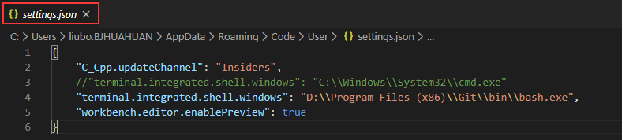

1、Windows下替换默认的终端

Windows下默认的终端是cmd，远程开发时的使用体验不敢恭维，所以一般用其他的终端替换vscode默认的cmd终端。

文件->首选项->设置，或者Ctrl+Shift+P。打开用户设置，应用到全局，也可以选择工作区设置，只应用到当前的工作区。
在功能->终端中找到Integrated>Automation Shell:Windows，或者直接搜索Integrated>Automation Shell:Windows，打开settings.json

```
{
    "C_Cpp.updateChannel": "Insiders",
    "terminal.integrated.shell.windows": "C:\\Windows\\System32\\cmd.exe"
}
```

Windows默认的终端是cmd的，用我们想要用的终端安装路径替换原有的cmd.exe路径。比如用git bash替换，将bash.exe的路径覆盖原有路径就可以了。
```
{
    "C_Cpp.updateChannel": "Insiders",
    "terminal.integrated.shell.windows": "D:\\Program Files (x86)\\Git\\bin\\bash.exe"
}
```


2、多个终端切换、终端清屏

vscode快捷键 Ctrl+` 可以打开集成的终端，但是在打开多个终端时，在多个终端间切换的快捷键需要自行设置。
文件->首选项->键盘快捷方式，或者Ctrl+Shift+P 输入关键字keyboard找到设置快捷键的选项。然后搜索terminal:focus next terminal：

鼠标选中Terminal: Focus Next Terminal，右键选择“添加键绑定”，然后按提示设置自己的快捷键，注意Ctrl+Tab的快捷键默认是给已经打开的编辑文件间切换用的。同样的步骤设置切换到上一个终端，关键词是Terminal: Focus Previous Terminal。

vscode默认清屏没有绑定快捷键，搜索Terminal:clear可以同上设置清屏的快捷键。按习惯可以设置为Ctrl+K，这个快捷键没有其他动作绑定，可以搜索Ctrl+K看是否有绑定其他动作。

3、关闭文件预览

在打开一个文件后，不做任何操作再打开另一个文件，会发现前一个文件被覆盖了，这是vscode默认的文件预览功能。除非在打开一个文件后有修改保存，或者在资源管理器的“打开的编辑器”中双击该文件，否则后面的文件会覆盖该文件。



根据文件名的显示方式可以看到当前文件是否是预览模式，新打开的文件名是倾斜字体显示的，有修改保存操作后会正常显示。


将"workbench.editor.enablePreview"修改成false，或者Ctrl+Shift+P。打开用户设置，找到Workbench>Editor:Enable Preview，勾选即可。


