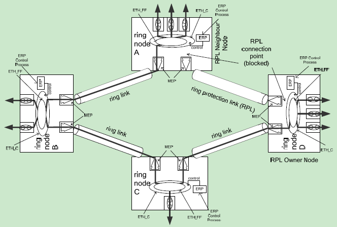

　　环网保护可能发生在环网中的任何一个节点，或同时发生在多个节点上。因此，整个环网保护的过程需要利用ＡＰＳ协议来对环网中发生的所有保护动作进行协调。

１、返回式和非返回式倒换
　　在返回式倒换中，由保护倒换引起的状态变化消息都被清除（故障修复），开始发送正常的ＮＲ消息后，运输通道恢复成原先的传输实体形式，同时阻塞主节点的副端口。整个环网恢复到故障之前的状态。
　　在非返回式倒换中，当故障修复之后，不执行返回式倒换中的恢复步骤，而是继续使用ＲＰＬ（即主节点副端口不阻塞 ）来传输数据报文。前提是ＲＰＬ链路正常工作，没有故障。
　　在某些情况下，理想的过程是在链路恢复之后，采用第一种方法，立即恢复链路的数据传输，并阻塞主节点副端口。而在部分案例中，立即恢复并不会给环网带来益处，这个时候就需要使用第二种方法。

２、保护倒换的触发
    保护倒换在下列三种情况下会被触发：
    （1）检测到链路中的ＳＦ（Signal Fail）消息，且优先级高于本节点处其他所有消息命令。
    （2）收到的R-APS消息中，含有要求进行保护倒换的字段，并且优先级高于本节点处其他所有消息命令。
    （3）在操作控制的过程中，被初始化操作触发，并且优先级高于本节点处其他所有消息命令。

3、单环的保护倒换

单环的环网模型如图

　　图中ERP Control Process通过函数ETH_FF来决定ETH_CI（可以理解为数据或协议报文）下一步的去处，即EHT_FP。同时，ERP控制模块还控制着链路的阻塞和打开，以及FDB的刷新。

在以太环网中，每个节点都通过周期性的发送检测消息来监测自己的状态。如图所示，每个节点链路连接的端口都标注有ＭＥＰ，各个节点通过ＭＥＰ来监测节点端口以及端口连接链路的状态变化。
　　如果ＭＥＰ检测到一个可能是ＳＦ的故障信息，就通知ＥＲＰ控制模块检测到了故障。然后，ＥＲＰ控制模块通过ＥＴＨ＿ＣＩ＿ＳＳＦ消息来示警链路出现故障。然后，阻塞发生故障的链路两端所连接的节点端口，并刷新ＦＤＢ表。
　　
　R-APS virtual channel为多个边缘节点之间提供一种 R-APS 的通信。R-APS virtual channel 在网络中的路径和传输路径一样。子环的ERP 控制进程能够通过 R-APS virtual channel 发送和接收 R-APS 消息。具体哪条或哪几条链路设置 virtual channel 来保证本节点R-APS 消息的传输，是可以配置的（可以通过 VLAN 的编号来区分）。

4、倒换恢复
节点检测到链路完好的信号（clearance of the SF condition），开启 Guard timer 。guard timer的作用是为了防止响应过期的 R-APS 消息，避免导致错误的节点状态而形成数据环路。当guard timer 执行时，只接受R-APS Specific Information中request/state field = “1110”的消息。

节点检测到清空SF的消息后，至少阻塞节点的一个端口，直到主节点的副端口被阻塞。此时，

主节点收到清空SF的消息后，启动 WTR 计时器，并发送 FDB flush 命令。如果超过 WTR 时限仍然没有收到消息，则节点自动打开端口，主节点阻塞副端口，恢复链路。

